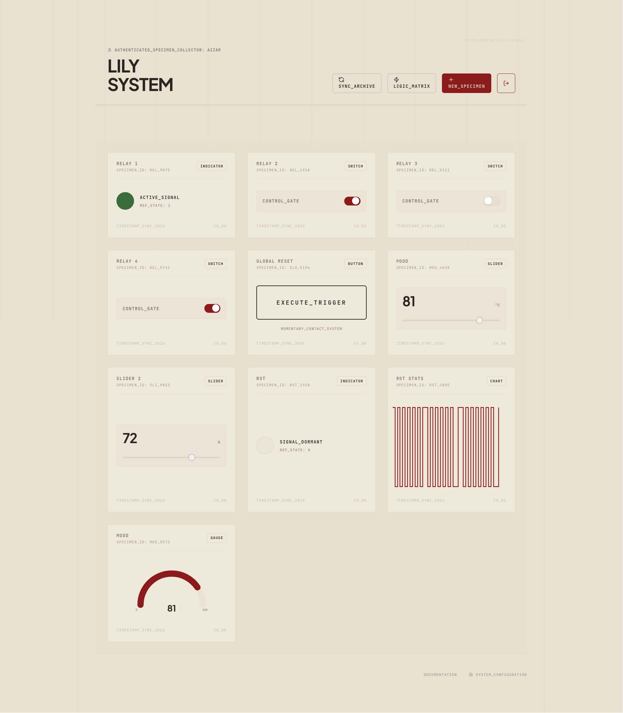
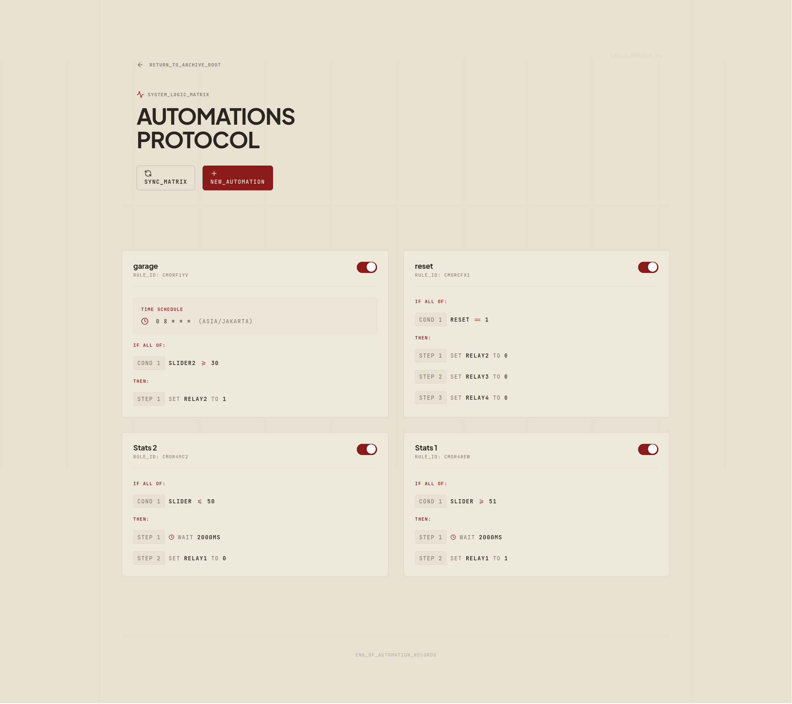

# IoT Archival Dashboard



A Swiss Archival-styled IoT dashboard designed as an elegant, robust, and highly functional interface for Adafruit IO. It features real-time updates, historical data tracking, and a powerful local automation engine.



## Overview

The IoT Archival Dashboard treats raw hardware data as curated museum artifacts. Every sensor reading, toggle state, and text log is referred to as a **Specimen**. By adopting a strict visual hierarchy—separating narrative content (Plus Jakarta Sans) from technical metadata (JetBrains Mono)—the system ensures that data is both beautiful to observe and rigorous to manage.

## Features

- **Swiss Archival Design**: Warm cream palette, blueprint grids, tactile noise grain, and minimalist glassmorphism elements.
- **Auto-Discovery**: Automatically fetches all active feeds from your Adafruit IO account.
- **Zero-Touch Provisioning**: Create new feeds directly from the dashboard without needing to access the Adafruit IO console.
- **Real-time Streaming**: Utilizes MQTT and Redis Pub/Sub to push instant updates via Server-Sent Events (SSE).
- **Advanced Logic Matrix (Automations)**:
  - Supports 1-to-1, 1-to-many, and many-to-many logic pipelines.
  - Multi-condition trigger support (`MATCH ALL` / `MATCH ANY`).
  - Mathematical and string evaluations (`>`, `<`, `==`, `!=`, `>=`, `<=`) running locally for ultra-low latency.
  - Sequential action execution with configurable delays between steps.
  - **Webhook Dispatch**: Trigger external APIs via POST with payload interpolation using `{{feedKey}}`.
  - **Cross-Account Automations**: Trigger rules on an event from one Adafruit IO account, evaluate conditions against feeds from another, and publish actions to a third.
- **Virtual Feeds (Open Data Integration)**:
  - Poll unauthenticated, external APIs (e.g. weather, crypto, transit) natively via BullMQ workers.
  - Extracted values (via JSONPath) are cached in Redis and treated identically to Adafruit IO hardware feeds.
  - Create dashboards and trigger automations solely from Open Data without needing cloud storage, or optionally route them to an Adafruit IO feed.
- **Multi-Account Aggregation Hub**:
  - Connect and manage multiple Adafruit IO accounts simultaneously.
  - Bypass free-tier feed limits by aggregating feeds from several accounts into one unified dashboard.
  - The Multi-Broker MQTT engine seamlessly maintains concurrent real-time connections to all provisioned accounts.
- **Security-First Approach**:
  - JWT-based authentication layer.
  - Local isolation ensures your Adafruit IO key never leaves the secure server environment.
  - SQLite with Prisma ORM for persistent local storage.

## Widget Types (Specimens)

- **MONITOR (READ)**: High-visibility numerical readouts for sensors.
- **CHART (HISTORY)**: Historical visualizations of numeric data streams.
- **TEXT_LOG (READ)**: Universal string data display for logs and statuses.
- **INDICATOR (STATUS)**: Boolean state visualizer.
- **SWITCH (TOGGLE)**: Boolean control gate (ON/OFF).
- **BUTTON (TRIGGER)**: Momentary pulse trigger (sends '1', auto-resets to '0').
- **SLIDER (RANGE)**: Analog control surface with custom low/high thresholds.
- **DATA_DUMP (WRITE)**: Unlimited capacity buffer for manual configuration payload transmission.

## Quick Start with Docker

### Prerequisites
- Docker & Docker Compose
- Adafruit IO Account

### Installation

1. **Clone the repository**:
   ```bash
   git clone https://github.com/your-username/iot-archival-dashboard.git
   cd iot-archival-dashboard
   ```

2. **Configure Environment Variables**:
   Copy the example environment file and fill in your Cloudflare Tunnel Token (if using the tunnel):
   ```bash
   cp .env.example .env
   ```

3. **Run with Docker Compose**:
   ```bash
   docker compose up -d --build
   ```

4. **Access the dashboard**: Open [http://localhost:3010](http://localhost:3010) in your browser. Register an initial admin account on the login screen to access the archive.

5. **Configure Credentials**: Navigate to **System Configuration** within the dashboard to set your Adafruit IO Username and Key securely.

## Tech Stack

- **Frontend**: Next.js 15, Tailwind CSS v4, Lucide React
- **Backend**: Next.js API Routes, MQTT.js, ioredis
- **Database**: SQLite with Prisma ORM
- **Cache**: Redis (Alpine)
- **Deployment**: Docker, Cloudflared Tunnel

## License

This project is licensed under the MIT License - see the [LICENSE](LICENSE) file for details.

Copyright (c) 2026 Azzar Budiyanto
